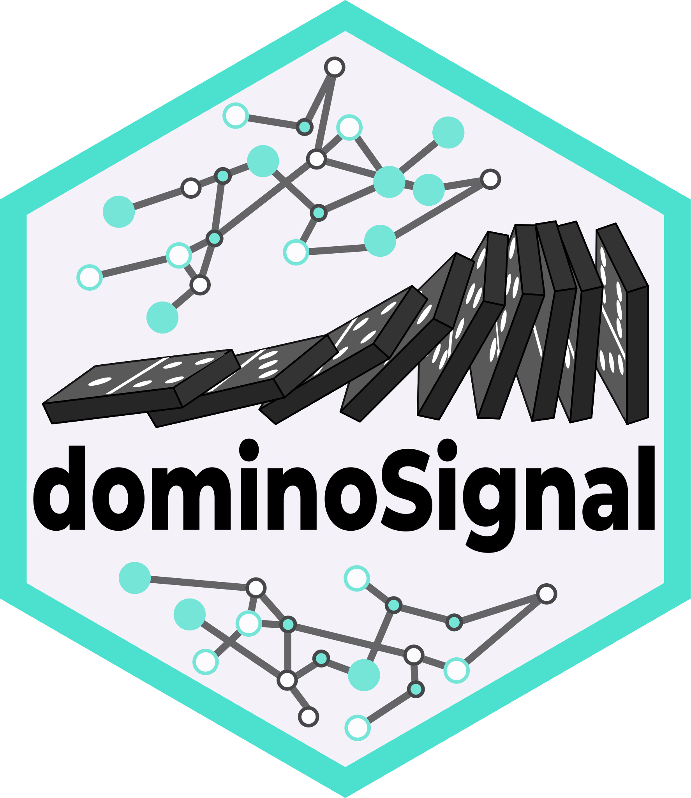

<!-- index.md is generated from index.Rmd. Please edit that file -->

```{r, include = FALSE}
knitr::opts_chunk$set(
    collapse = TRUE,
    comment = "#>",
    fig.path = "man/figures/README-",
    out.width = "100%"
)
```

## Introducing dominoSignal <a href="https://fertiglab.github.io/dominoSignal/"></a>

dominoSignal is an updated version of the original [domino](https://github.com/Elisseeff-Lab/domino) R package published in Nature Biomedical Engineering in [Computational reconstruction of the signalling networks surrounding implanted biomaterials from single-cell transcriptomics](https://doi.org/10.1038/s41551-021-00770-5). dominoSignal is a tool for analysis of intra- and intercellular signaling in single cell RNA sequencing data based on transcription factor activation and receptor and ligand linkages.

## Installation

dominoSignal is undergoing active development to improve analysis capabilities and interpretability, so the codebase is subject to change as new features and fixes are implemented. v0.2.2 of dominoSignal serves as the current stable version during these active updates for reproducible usage (see our [changelog](news/index.html) for more information on changes).

This version is currently hosted on the [FertigLab GitHub](https://github.com/FertigLab) on the [dominoSignal repository](https://github.com/FertigLab/dominoSignal) forked from the primary repository hosted on the [Elisseeff-Lab GitHub](https://github.com/Elisseeff-Lab/domino), and can be installed using the remotes package.

```{r, eval = FALSE}
if (!require(remotes)) {
    install.packages("remotes")
}
remotes::install_github("FertigLab/dominoSignal")
```

## Usage Overview

Here is an overview of how dominoSignal might be used in analysis of a single cell RNA sequencing data set:

1. Transcription factor activation scores are calculated (we recommend using [pySCENIC](https://pyscenic.readthedocs.io/en/latest/), but other methods can be used as well). For more information on how to use SCENIC, please see our [Using SCENIC for TF Activation](vignette("articles/scenic_vignette")) page.
2. A ligand-receptor database is used to map linkages between ligands and receptors (we recommend using [cellphoneDB](https://www.cellphonedb.org/), but other methods can be used as well). For information on downloading the necessary files for cellphoneDB, please see our [Using the cellphoneDB Database](vignette("articles/cellphonedb_vignette")) page.
3. A domino object is created using counts, z-scored counts, clustering information, and the data from steps 1 and 2.
4. Parameters such as the maximum number of transcription factors and receptors or the minimum correlation threshold (among others) are used to make a cell communication network
5. Communication networks can be extracted from within the domino object or visualized using a variety of plotting functions

Please see the [Getting Started](vignette("dominoSignal")) page for an example analysis that includes all of these steps in a dominoSignal analysis in detail, from creating a domino object to parameters for building the network to visualizing domino results. Other articles include further details on [plotting functions](vignette("plotting_vignette")) and the structure of the [domino object](vignette("domino_object_vignette")).
