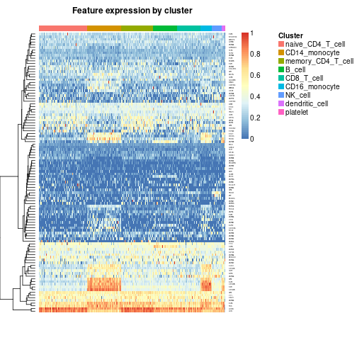
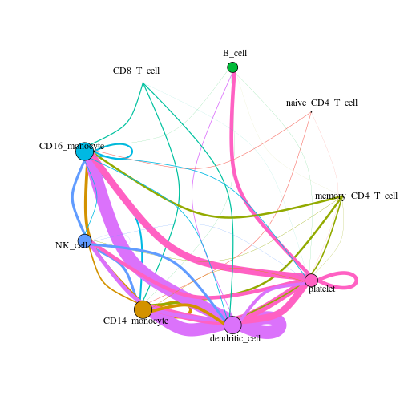
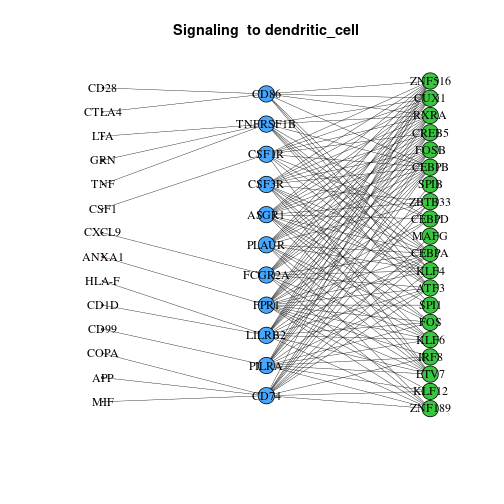
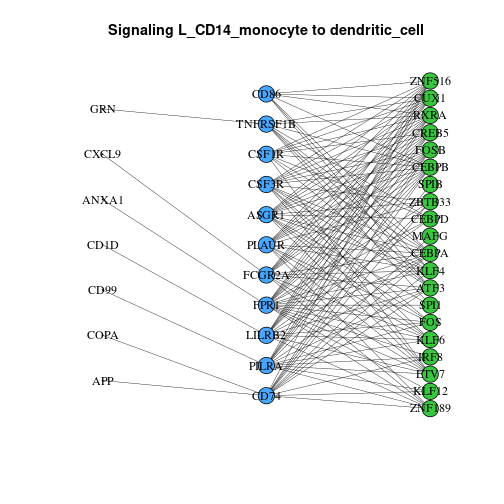
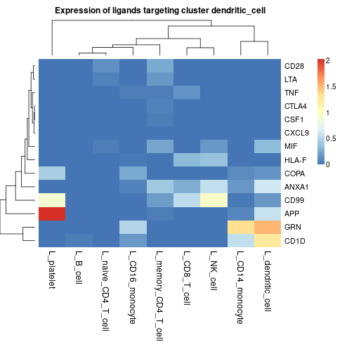
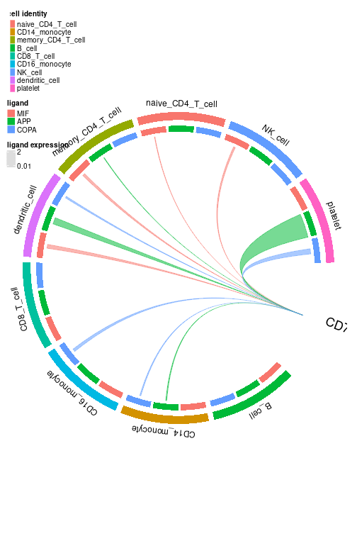

# Using domino2 v0.2.1 for cell-cell communication inference

domino2 is a tool for analysis of intra- and intercellular signaling in single cell RNA sequencing (scRNAseq) data based on transcription factor (TF) activation. Here, we show a basic example pipeline for generating communication networks as a domino object. This vignette will demonstrate how to use domino2 on the 10X Genomics Peripheral Blood Mononuclear Cells (PBMC) data set of 2,700 cells. The data can be downloaded [here](https://cf.10xgenomics.com/samples/cell/pbmc3k/pbmc3k_filtered_gene_bc_matrices.tar.gz).

## Preprocessing scRNAseq data

Analysis of cell-cell communication with domino2 often follows initial processing and annotation of scRNAseq data.  We are following the [Satija Lab's Guided Clustering Tutorial](https://satijalab.org/seurat/articles/pbmc3k_tutorial) to prepare the data set for analysis with domino2.


```r
# Preprocessing of PBMC 3K tutorial data set using Seurat functions
pbmc.data <- Read10X(data.dir = "../data/pbmc3k_filtered_gene_bc_matrices")
pbmc <- CreateSeuratObject(counts = pbmc.data, project = "pbmc3k", min.cells = 3, min.features = 200)
pbmc[["percent.mt"]] <- PercentageFeatureSet(pbmc, pattern = "^MT-")
pbmc <- NormalizeData(pbmc, normalization.method = "LogNormalize", scale.factor = 10000)
pbmc <- FindVariableFeatures(pbmc, selection.method = "vst", nfeatures = 2000)
pbmc <- ScaleData(pbmc, features = rownames(pbmc))
pbmc <- RunPCA(pbmc, features = VariableFeatures(object = pbmc))
pbmc <- FindNeighbors(pbmc, dims = 1:10)
pbmc <- FindClusters(pbmc, resolution = 0.5)
pbmc <- RunUMAP(pbmc, dims = 1:10)
# Annotate clusters with cell phenotypes
cell_dict <- data.frame(
  cluster = c(0:8),
  cell_type = c("naive_CD4_T_cell", "CD14_monocyte", "memory_CD4_T_cell", "B_cell", "CD8_T_cell", "CD16_monocyte", "NK_cell", "dendritic_cell", "platelet")
)
pbmc$cell_type <-
  plyr::mapvalues(
    pbmc$seurat_clusters,
    from = cell_dict$cluster,
    to = cell_dict$cell_type
  )
```

### Saving Preprocessed Data:
domino2 was designed to be compatible with `{Seurat}` objects in addition to accepting matrices and vectors of the data set as function inputs. Therefore, it's a good idea to save the processed `{Seurat}` object for further analysis. However, [pySCENIC](https://pyscenic.readthedocs.io/en/latest/) is used for TF activation inference, and it requires as input a cell by gene matrix. This is the opposite orientation of `{Seurat}` objects but is the default for Python based tools such as [scanpy](https://scanpy.readthedocs.io/en/stable/). Saving our data as a loom file using `{loomR}` will be helpful for that step and is therefore recommended as well.


```r
# save Seurat object as RDS
saveRDS(pbmc, file = "../data/pbmc3k_seurat.rds")

# save loom counts matrix
pbmc_counts <- pbmc@assays$RNA@counts
pbmc_loom <- loomR::create(filename = "../data/pbmc3k_counts.loom", data = pbmc_counts)
pbmc_loom$close_all() # Remember to manually close connection to loom files!
```

The cell x gene counts matrix may also be saved as a tab-separated value (.tsv) file if `{loomR}` cannot be used on your computing resource, but be aware that dense formatting of a .tsv can lead to very large file sizes and slow processing for large data sets. We have provided the necessary code below, but due to the large file size, this .tsv file is not provided in our data directory.

```r
pbmc_counts <- pbmc@assays$RNA@counts
write.table(t(as.matrix(pbmc_counts)), "../data/pbmc3k_counts.tsv",
  sep = "\t", col.names = NA
)
```

If you would like to skip ahead to the rest of the analysis, the processed objects from these steps are available in the data directory of this package.

## Installation

Installation of domino2 from Github can be achieved using the `{remotes}` package. The current stable version is v0.2.1, so we will install that branch.


```r
if (!require(remotes)) {
  install.packages("remotes")
}
remotes::install_github("FertigLab/domino_development@v0.2.1")
```

### Additional Downloads
For this tutorial, [pySCENIC](https://pyscenic.readthedocs.io/en/latest/) is used as the method for TF activity inference and the assessment of ligand-receptor interactions is based on curated interactions from [CellPhoneDB v4.0.0](https://github.com/ventolab/cellphonedb-data/releases/tag/v4.0.0). Each of these requires downloading some files prior to use in our analysis pipeline.

#### Downloads for SCENIC:

A singularity image of [SCENIC](https://scenic.aertslab.org/) v0.12.1 can be installed from the DockerHub image as a source (example scripts for use with Docker are provided in the scenic\_bash directory as well). [SCENIC](https://scenic.aertslab.org/) requires a list of TFs, motif annotations, and cisTarget motifs which are all available from the authors of [SCENIC](https://scenic.aertslab.org/) for human (HGNC), mouse (MGI), and fly. The following will download everything necessary for an analysis of a data set with HGNC gene labels for the hg38 genome.


```bash
SCENIC_DIR="../scenic"
mkdir ${SCENIC_DIR}

# Build singularity image
singularity build "${SCENIC_DIR}/aertslab-pyscenic-0.12.1.sif" docker://aertslab/pyscenic:0.12.1

# Matrix containing motifs as rows and genes as columns and ranking position for each gene and motif (based on CRM scores) as values
# below is a feather v1 format link; feather v2 required for this version of pySCENIC
# "https://resources.aertslab.org/cistarget/databases/old/homo_sapiens/hg38/refseq_r80/mc9nr/gene_based/hg38__refseq-r80__10kb_up_and_down_tss.mc9nr.feather"
# Feather v2 link:
curl "https://resources.aertslab.org/cistarget/databases/homo_sapiens/hg38/refseq_r80/mc_v10_clust/gene_based/hg38_10kbp_up_10kbp_down_full_tx_v10_clust.genes_vs_motifs.rankings.feather" \
  -o "${SCENIC_DIR}/hg38_10kbp_up_10kbp_down_full_tx_v10_clust.genes_vs_motifs.rankings.feather"

# below is a feather v1 format link; feather v2 required for this version of pySCENIC
# "https://resources.aertslab.org/cistarget/databases/old/homo_sapiens/hg38/refseq_r80/mc9nr/gene_based/hg38__refseq-r80__500bp_up_and_100bp_down_tss.mc9nr.feather"
# Feather v2 link:
curl "https://resources.aertslab.org/cistarget/databases/homo_sapiens/hg38/refseq_r80/mc_v10_clust/gene_based/hg38_500bp_up_100bp_down_full_tx_v10_clust.genes_vs_motifs.rankings.feather" \
  -o "${SCENIC_DIR}/hg38_500bp_up_100bp_down_full_tx_v10_clust.genes_vs_motifs.rankings.feather"

# List of genes encoding TFs in the HG38 reference genome
curl "https://resources.aertslab.org/cistarget/tf_lists/allTFs_hg38.txt" \
  -o "${SCENIC_DIR}/allTFs_hg38.txt"

# Motif annotations based on the 2017 cisTarget motif collection. Use these files if you are using the mc9nr databases.
curl "https://resources.aertslab.org/cistarget/motif2tf/motifs-v9-nr.hgnc-m0.001-o0.0.tbl" \
  -o "${SCENIC_DIR}/motifs-v9-nr.hgnc-m0.001-o0.0.tbl"
```

#### Downloads for CellPhoneDB:

Database files from [CellPhoneDB v4.0.0](https://github.com/ventolab/cellphonedb-data/releases/tag/v4.0.0) for human scRNAseq data can be installed from a public Github repository from the Tiechmann Group that developed CellPhoneDB.


```bash
CELLPHONE_DIR="../cellphonedb"
mkdir ${CELLPHONE_DIR}

# Annotation of protein complexes
curl "https://raw.githubusercontent.com/Teichlab/cellphonedb-data/master/data/complex_input.csv" \
  -o "${CELLPHONE_DIR}/complex_input.csv"
# Annotation of genes encoding database proteins
curl "https://raw.githubusercontent.com/Teichlab/cellphonedb-data/master/data/gene_input.csv" \
  -o "${CELLPHONE_DIR}/gene_input.csv"
# Annotated protein interactions
curl "https://raw.githubusercontent.com/Teichlab/cellphonedb-data/master/data/interaction_input.csv" \
  -o "${CELLPHONE_DIR}/interaction_input.csv"
# Annotated protein features
curl "https://raw.githubusercontent.com/Teichlab/cellphonedb-data/master/data/protein_input.csv" \
  -o "${CELLPHONE_DIR}/protein_input.csv"
```

## SCENIC Analysis

SCENIC is our lab's preferred software for TF activity scoring. We recommend using the Python implementation ([pySCENIC](https://pyscenic.readthedocs.io/en/latest/)) as it is faster than the original R implementation. Be aware, the use of [SCENIC](https://scenic.aertslab.org/) is often the slowest and most memory intensive step of this analysis pipeline. [SCENIC](https://scenic.aertslab.org/) should be run on computing resources with access to multi-core processing and large amounts of memory.

As described in the section on saving preprocessed data, [SCENIC](https://scenic.aertslab.org/) requires RNA counts to be provided in a cell by gene matrix format, so we will be using the pbmc3k\_counts.loom file in this stage of analysis.

[pySCENIC](https://pyscenic.readthedocs.io/en/latest/) is initiated using bash scripting in the terminal. The analysis consists of 3 steps to score genes for TF motif enrichment, construct TF regulons consisting of genes targeted by the TFs, and arrive at AUC scores for enrichment of regulon gene transcription within each cell.

### grn: construct TF-modules

Co-expression modules are used to quantify gene-TF adjacencies.


```bash
singularity exec "${SCENIC_DIR}/aertslab-pyscenic-0.12.1.sif" pyscenic grn \
    "../data/pbmc3k_counts.loom" \
    "${SCENIC_DIR}/allTFs_hg38.txt" \
    -o "${SCENIC_DIR}/pbmc_adj.tsv" \
    --num_workers 6 \
    --seed 123

# Arguments:
    # path to the loom file
    # list of TFs
    # output directory for the adjacency matrix
    # number of CPUs to use if multi-core processing is available
    # specify a random seed for reproducibility
```

### ctx: construct TF regulons with pruning based on TF motif enrichment

The rankings of genes based on enrichment of TF motifs to the transcription start site (TSS) are considered in the construction of regulons, where target genes in the TF-modules are removed if they lack motifs proximal to the TSS where the TF may bind.


```bash
singularity exec "${SCENIC_DIR}/aertslab-pyscenic-0.12.1.sif" pyscenic ctx \
    "${SCENIC_DIR}/pbmc_adj.tsv" \
    "${SCENIC_DIR}/hg38_10kbp_up_10kbp_down_full_tx_v10_clust.genes_vs_motifs.rankings.feather" \
    "${SCENIC_DIR}/hg38_500bp_up_100bp_down_full_tx_v10_clust.genes_vs_motifs.rankings.feather" \
    --annotations_fname "${SCENIC_DIR}/motifs-v9-nr.hgnc-m0.001-o0.0.tbl" \
    --expression_mtx_fname "data/pbmc3k_counts.loom" \
    --mode "dask_multiprocessing" \
    --output "${SCENIC_DIR}/pbmc_regulons.csv" \
    --num_workers 1                                                          

# Arguments:
    # adjacency matrix output from grn
    # target rankings of motif enrichment within 10 kb of TSS
    # target rankings of motif enrichment within 500 bp upstream and 100 bp downstream of TSS
    # TF motif features
    # counts matrix loom file
    # enable multi-core processing
    # output file of learned TF regulons
    # number of CPU cores
```

### aucell: calculate TF activity scores

Enrichment of a regulon is measured as the Area Under the recovery Curve (AUC) of the genes that define this regulon.


```bash
singularity exec "${SCENIC_DIR}/aertslab-pyscenic-0.12.1.sif" pyscenic aucell \
  	"../data/pbmc3k_counts.loom" \
  	"${SCENIC_DIR}/pbmc_regulons.csv" \
  	-o "${SCENIC_DIR}/pbmc_auc.csv"
    
# Arguments:
    # counts matrix loom file
    # regulon table output from ctx
    # cell x TF matrix of TF enrichment AUC values
```

## Building a Signaling Network with domino2

### Loading SCENIC Results

The TF activities are a required input for domino2, and the regulons learned by [SCENIC](https://scenic.aertslab.org/) are an important but optional input needed to annotate TF-target interactions and to prune TF-receptor linkages where the receptor is a target of the TF. This prevents the distinction of receptor expression driving TF activity or the TF inducing the receptor's expression.


```r
scenic_dir <- "../scenic/"
regulons <- read.csv(paste0(scenic_dir, "/pbmc_regulons.csv"))
auc <- read.table(paste0(scenic_dir, "/pbmc_auc.csv"),
  header = TRUE, row.names = 1,
  stringsAsFactors = FALSE, sep = ","
)
```

The initial regulons data frame read into R from the ctx function has 2 rows of column names that need to be replaced with one succinct description. domino2 has changed the input format for TF regulons to be a list storing vectors of target genes in each regulon, where the names of the list are the TF genes. This facilitates the use of alternative methods for TF activity quantification methods. We provide a helper function, `create_regulon_list_scenic()` for easy retrieval of TF regulons from the output of the [pySCENIC](https://pyscenic.readthedocs.io/en/latest/) ctx function.


```r
regulons <- regulons[-1:-2, ]
colnames(regulons) <- c("TF", "MotifID", "AUC", "NES", "MotifSimilarityQvalue", "OrthologousIdentity", "Annotation", "Context", "TargetGenes", "RankAtMax")
regulon_list <- create_regulon_list_scenic(regulons = regulons)
```

Users should be aware that the AUC matrix from [SCENIC](https://scenic.aertslab.org/) is loaded in a cell x TF orientation and should be transposed to TF x cell orientation. pySCENIC also appends "(+)" to TF names that are converted to "..." upon loading into R. These characters can be included without affecting the results of domino2 analysis, but can be confusing when querying TF features in the data. We recommend comprehensive removal of the "..." characters using the `gsub()` function.


```r
auc_in <- as.data.frame(t(auc))
# Remove pattern "..." from the end of all rownames:
rownames(auc_in) <- gsub("\\.\\.\\.$", "", rownames(auc_in))
```

### Load CellPhoneDB Database

domino2 has been updated to read ligand-receptor data bases in a uniform data.frame format referred to as a receptor-ligand map (rl\_map) to enable the use of alternative or updated reference databases as opposed to a particular version of CellPhoneDB's database in older versions of Domino. Each row corresponds to a ligand-receptor interaction. Genes participating in an interaction are referred to as "partner A" and "partner B" without a requirement for fixed ordering of whether A or B is the ligand and vice versa. The minimum required columns of this data frame are:

- int\_pair: the names of the interacting ligand and receptor separated by " & "
- gene\_A: the gene or genes encoding partner A
- gene\_B: the gene or genes encoding partner B
- type\_A: ("L", "R") whether partner A is a ligand ("L") or receptor ("R")
- type\_B: ("L", "R") whether partner B is a ligand ("L") or receptor ("R")

Additional annotation columns can be provided such as name\_A and name\_B for ligands or receptors whose name in the interaction database does not match the names of their encoding genes. This formatting also allows for the consideration of ligand and receptor complexes comprised of a heteromeric combination of multiple proteins that must be co-expressed to function. In these cases, the "name\_\*" column shows the name of the protein complex, and the "gene\_\*" column shows the names of the genes encoding the components of the complex separated by commas ",". When plotting results from the build domino object, the names of the interacting ligands and receptors will be used based on combinatorial expression of the complex components.

To facilitate the use of this formatting with the CellPhoneDB database, we include a helper function, `create_rl_map_cellphonedb()`, that automatically parses files from the cellPhoneDB database to arrive at the rl\_map format.


```r
cellphonedb_2_path <- "../cellphonedb"
complexes <- read.csv(paste0(cellphonedb_2_path, "/complex_input.csv"), stringsAsFactors = FALSE)
genes <- read.csv(paste0(cellphonedb_2_path, "/gene_input.csv"), stringsAsFactors = FALSE)
interactions <- read.csv(paste0(cellphonedb_2_path, "/interaction_input.csv"), stringsAsFactors = FALSE)
proteins <- read.csv(paste0(cellphonedb_2_path, "/protein_input.csv"), stringsAsFactors = FALSE)

rl_map <- create_rl_map_cellphonedb(
  genes = genes,
  proteins = proteins,
  interactions = interactions,
  complexes = complexes,
  database_name = "CellPhoneDB_v4.0" # database version used
)

knitr::kable(head(rl_map))
```


|int_pair           |name_A  |uniprot_A |gene_A  |type_A |name_B   |uniprot_B |gene_B   |type_B |annotation_strategy     |source         |database_name    |
|:------------------|:-------|:---------|:-------|:------|:--------|:---------|:--------|:------|:-----------------------|:--------------|:----------------|
|FGF4 & FGFR1       |FGF4    |P08620    |FGF4    |L      |FGFR1    |P11362    |FGFR1    |R      |I2D                     |               |CellPhoneDB_v4.0 |
|ADORA3 & ENTPD1    |ADORA3  |P0DMS8    |ADORA3  |R      |ENTPD1   |P49961    |ENTPD1   |L      |curated                 |uniprot        |CellPhoneDB_v4.0 |
|EPHB3 & EFNB1      |EPHB3   |P54753    |EPHB3   |R      |EFNB1    |P98172    |EFNB1    |L      |curated                 |PMID: 15114347 |CellPhoneDB_v4.0 |
|TNFSF18 & TNFRSF18 |TNFSF18 |Q9UNG2    |TNFSF18 |L      |TNFRSF18 |Q9Y5U5    |TNFRSF18 |R      |curated                 |uniprot        |CellPhoneDB_v4.0 |
|EFNA1 & EPHA1      |EFNA1   |P20827    |EFNA1   |L      |EPHA1    |P21709    |EPHA1    |R      |curated                 |PMID: 15114347 |CellPhoneDB_v4.0 |
|PYY & NPY2R        |PYY     |P10082    |PYY     |L      |NPY2R    |P49146    |NPY2R    |R      |guidetopharmacology.org |               |CellPhoneDB_v4.0 |


#### Optional: Adding interactions manually
The change to use rl\_map formatting also enables users to manually append interactions of interest that are not included in the interaction database if need be. This can be attained by formatting the desired interactions as a data.frame with the same column headers as the rl\_map and using the `rbind()` function.


```r
# Integrin complexes are not annotated as receptors in CellPhoneDB_v4.0
# collagen-integrin interactions between cells may be missed unless tables from the CellPhoneDB reference are edited or the interactions are manually added

col_int_df <- data.frame(
  "int_pair" = "a11b1 complex & COLA1_HUMAN",
  "name_A" = "a11b1 complex", "uniprot_A" = "P05556,Q9UKX5", "gene_A" = "ITB1,ITA11", "type_A" = "R",
  "name_B" = "COLA1_HUMAN", "uniprot_B" = "P02452,P08123", "gene_B" = "COL1A1,COL1A2", "type_B" = "L",
  "annotation_strategy" = "manual", "source" = "manual", "database_name" = "manual"
)
rl_map_append <- rbind(col_int_df, rl_map)
knitr::kable(head(rl_map_append))
```


|    |int_pair                    |name_A        |uniprot_A     |gene_A     |type_A |name_B      |uniprot_B     |gene_B        |type_B |annotation_strategy |source         |database_name    |
|:---|:---------------------------|:-------------|:-------------|:----------|:------|:-----------|:-------------|:-------------|:------|:-------------------|:--------------|:----------------|
|1   |a11b1 complex & COLA1_HUMAN |a11b1 complex |P05556,Q9UKX5 |ITB1,ITA11 |R      |COLA1_HUMAN |P02452,P08123 |COL1A1,COL1A2 |L      |manual              |manual         |manual           |
|111 |FGF4 & FGFR1                |FGF4          |P08620        |FGF4       |L      |FGFR1       |P11362        |FGFR1         |R      |I2D                 |               |CellPhoneDB_v4.0 |
|2   |ADORA3 & ENTPD1             |ADORA3        |P0DMS8        |ADORA3     |R      |ENTPD1      |P49961        |ENTPD1        |L      |curated             |uniprot        |CellPhoneDB_v4.0 |
|3   |EPHB3 & EFNB1               |EPHB3         |P54753        |EPHB3      |R      |EFNB1       |P98172        |EFNB1         |L      |curated             |PMID: 15114347 |CellPhoneDB_v4.0 |
|4   |TNFSF18 & TNFRSF18          |TNFSF18       |Q9UNG2        |TNFSF18    |L      |TNFRSF18    |Q9Y5U5        |TNFRSF18      |R      |curated             |uniprot        |CellPhoneDB_v4.0 |
|5   |EFNA1 & EPHA1               |EFNA1         |P20827        |EFNA1      |L      |EPHA1       |P21709        |EPHA1         |R      |curated             |PMID: 15114347 |CellPhoneDB_v4.0 |


## Creating the Domino Object

domino2 analysis takes place in two steps. 
1. `create_domino()`
  a. initializes the domino result object
  b. assesses differential TF activity across cell clusters by wilcoxon rank-sum test
  c. establishes TF-receptor linkages based on Spearman correlation of TF activities with receptor expression across the queried data set. 
2. `build_domino()`
  a. sets the parameters for which TFs and receptors are called as active within a cell cluster
  b. aggregates the scaled expression of ligands capable of interacting with the active receptors for assessment of ligand type and cellular source triggering activation of a receptor.

### Required inputs from data set

domino2 infers active receipt of signals via receptors based on the correlation of the receptor's expression with TF activity across the data set and differential activity of the TF within a cell cluster. Correlations are conducted using scaled expression values rather than raw counts or normalized counts. For assessment of receptor activity on a per cell type basis, a named vector of cell cluster assignments, where the names are cell barcodes matching the expression matrix, are provided. Assessing signaling based on other categorical groupings of cells can be achieved by passing these groupings as "clusters" to `build_domino()` in place of cell types. domino2 accepts either a `{Seurat}` object with counts, scaled counts, and clusters included, or it requires a matrix of counts, a matrix of scaled counts, and a named vector of cell cluster labels as factors. Shown below is how to extract these elements from a `{Seurat}` object.


```r
counts <- pbmc@assays$RNA@counts
z_scores <- as.matrix(pbmc@assays$RNA@scale.data)
clusters <- as.factor(pbmc$cell_type)
```

Note: Ligand and receptor expression can only be assessed for genes included in the z\_scores matrix. Many scRNAseq analysis pipelines recommend storing only genes with high variance in scaled expression slots for these data objects, thereby missing many genes encoding ligands and receptors. **Ensure that all your genes of interest are included in the rows of your z\_scores matrix.** Scaled expression was calculated for all genes in this PBMC data set after removal of genes expressed in less than 3 cells. 

### Create Domino object

At this point, the `create_domino()` function can be used to make the object. Parameters of note include "use\_clusters" which is required to assess signaling between cell types rather than linkage of TFs and receptors broadly across the data set. "use\_complexes" decides if receptors that function in heteromeric complexes will be considered in testing linkages between TFs and receptors. If TRUE, a receptor complex is only linked to a TF if a majority of the component genes meet the Spearman correlation threshold. "remove\_rec\_dropout" decides whether receptor values of 0 will be considered in correlation calculations; this measure is intended to reduce the effect of dropout on receptors with low expression.

To run `create_domino()` with matrix and vector inputs:

```r
pbmc_dom <- create_domino(
  rl_map = rl_map, # receptor-ligand map data frame
  features = auc_in, # TF scores (AUC matrix)
  counts = counts, # counts matrix
  z_scores = z_scores, # scaled expression data
  clusters = clusters, # vector of cell cluster assignments
  tf_targets = regulon_list, # list of TFs and their regulons
  use_clusters = TRUE, # assess receptor activation and ligand expression on a per-cluster basis
  use_complexes = TRUE, # include receptors and genes that function as a complex in results
  remove_rec_dropout = FALSE # whether to remove zeroes from correlation calculations
)
```

The above results will be equivalent to using the `{Seurat}` object directly. Note that inclusion of both the matrix inputs and the `{Seurat}` object will prioritize the `{Seurat}` object.

```r
pbmc_dom <- create_domino(
  rl_map = rl_map, # receptor-ligand map data frame
  features = auc_in, # TF scores (AUC matrix)
  ser = pbmc, # Seurat object containing counts, scaled counts, and cell cluster assignments
  tf_targets = regulon_list, # list of TFs and their regulons
  use_clusters = TRUE, # assess receptor activation and ligand expression on a per-cluster basis
  use_complexes = TRUE, # include receptors and genes that function as a complex in results
  remove_rec_dropout = FALSE # whether to remove zeroes from correlation calculations
)
```

For information on what is stored in a domino object and how to access it, please see our [vignette on the structure of domino objects](vignette("domino_object_vignette")).

### Build Domino

`build_domino()` finalizes the construction of the domino object by setting parameters for identifying TFs with differential activation between clusters, receptor linkage with TFs based on magnitude of positive correlation, and the minimum percentage of cells within a cluster that have expression of a receptor for the receptor to be called as active.

There are also options for thresholds of the number of TFs that may be called active in a cluster and the number of receptors that may be linked to any one TF. For thresholds of _n_ TFs and _m_ receptors, the bottom _n_ TFs by lowest p-values from the wilcoxon rank sum test and the top _m_ receptors by Spearman correlation coefficient are chosen.


```r
pbmc_dom <- build_domino(
  dom = pbmc_dom,
  min_tf_pval = .001, # Threshold for p-value of DE for TFs
  max_tf_per_clust = 25,
  max_rec_per_tf = 25,
  rec_tf_cor_threshold = .25, # Minimum correlation between receptor and TF
  min_rec_percentage = 0.1 # Minimum percent of cells that must express receptor
)
```

Both of the thresholds for the number of receptors and TFs can be sent to infinity (Inf) to collect all receptors and TFs that meet statistical significance thresholds.


```r
pbmc_dom_all <- build_domino(
  dom = pbmc_dom,
  min_tf_pval = .001,
  max_tf_per_clust = Inf,
  max_rec_per_tf = Inf,
  rec_tf_cor_threshold = .25,
  min_rec_percentage = 0.1
)
```

## Visualization of Domino Results

Multiple functions are available to visualize the intracellular networks between receptors and TFs and the ligand-receptor mediated intercellular networks between cell types.

### Summarize TF Activity and Linkage

Enrichment of TF activities by cell types can be visualized by `feat_heatmap()` which plots data set-wide TF activity scores as a heatmap.


```r
feat_heatmap(pbmc_dom, norm = TRUE, bool = FALSE)
```



### Cumulative signaling between cell types

The cumulative degree of signaling between clusters is assessed as the sum of the scaled expression of ligands targeting active receptors on another cluster. This can be visualized in graph format using the `signaling_network()` function. Nodes represent each cell cluster and edges scale with the magnitude of signaling between the clusters. The color of the edge corresponds to the sender cluster for that signal.


```r
signaling_network(pbmc_dom, edge_weight = 1, max_thresh = 5)
```



Signaling networks can also be drawn with the edges only rendering the signals directed towards a given cell type or signals from one cell type directed to others. To see those options in use, as well as other plotting functions and their options, please see our [plotting vignette](vignette("plotting_vignette")).

### Specific Signaling Interactions between Clusters

Beyond the aggregated degree of signaling between cell types, the degrees of signaling through specific ligand-receptor interactions can be assessed. `gene_network()` provides a graph of linkages between active TFs in a cluster, the linked receptors in that cluster, and the possible ligands of these active receptors.


```r
gene_network(pbmc_dom, clust = "dendritic_cell", layout = "grid")
```



New to domino2, `gene_network()` can be used between two clusters to determine if any of the possible ligands for a given receptor are expressed by a putative outgoing signaling cluster.


```r
gene_network(pbmc_dom,
  clust = "dendritic_cell", OutgoingSignalingClust = "CD14_monocyte",
  layout = "grid"
)
```



A comprehensive assessment of ligand expression targeting active receptors on a given cluster can be assessed with `incoming_signaling_heatmap()`.


```r
incoming_signaling_heatmap(pbmc_dom, rec_clust = "dendritic_cell", max_thresh = 2.5)
```



Another form of comprehensive ligand expression assessment is available for individual active receptors in the form of circos plots new to domino2. The outer arcs correspond to clusters in the domino object with inner arcs representing each possible ligand of the plotted receptor. Arcs are drawn between ligands on a cell type and the receptor if the ligand is expressed above the specified threshold. Arc widths correspond to the mean express of the ligand by the cluster with the widest arc width scaling to the maximum expression of the ligand within the data.


```r
circos_ligand_receptor(pbmc_dom, receptor = "CD74")
```



## Continued Development

Since domino2 is a package still being developed, there are new functions and features that will be implemented in future versions. In the meantime, we have put together further information on [plotting](vignette("plotting_vignette")) and the [domino object structure](vignette("domino_object_vignette")) if you would like to explore more of the package's functionality. Additionally, if you find any bugs, have further questions, or want to share an idea, please let us know [here](https://github.com/FertigLab/domino_development/issues).

<details><summary>Vignette Build Information</summary>
Date last built and session information:

```r
Sys.Date()
#> [1] "2023-09-26"
sessionInfo()
#> R version 4.2.1 (2022-06-23)
#> Platform: x86_64-pc-linux-gnu (64-bit)
#> Running under: Ubuntu 22.04.2 LTS
#> 
#> Matrix products: default
#> BLAS:   /usr/lib/x86_64-linux-gnu/blas/libblas.so.3.10.0
#> LAPACK: /usr/lib/x86_64-linux-gnu/lapack/liblapack.so.3.10.0
#> 
#> locale:
#>  [1] LC_CTYPE=en_US.UTF-8       LC_NUMERIC=C              
#>  [3] LC_TIME=en_US.UTF-8        LC_COLLATE=en_US.UTF-8    
#>  [5] LC_MONETARY=en_US.UTF-8    LC_MESSAGES=en_US.UTF-8   
#>  [7] LC_PAPER=en_US.UTF-8       LC_NAME=C                 
#>  [9] LC_ADDRESS=C               LC_TELEPHONE=C            
#> [11] LC_MEASUREMENT=en_US.UTF-8 LC_IDENTIFICATION=C       
#> 
#> attached base packages:
#> [1] grid      stats     graphics  grDevices utils     datasets  methods  
#> [8] base     
#> 
#> other attached packages:
#>  [1] patchwork_1.1.3       RColorBrewer_1.1-3    Biobase_2.56.0       
#>  [4] BiocGenerics_0.42.0   knitr_1.44            ComplexHeatmap_2.12.1
#>  [7] circlize_0.4.15       plyr_1.8.8            loomR_0.2.1.9000     
#> [10] hdf5r_1.3.8           R6_2.5.1              SeuratObject_4.1.3   
#> [13] Seurat_4.3.0.1        domino2_0.2.1        
#> 
#> loaded via a namespace (and not attached):
#>   [1] utf8_1.2.3             spatstat.explore_3.2-3 reticulate_1.32.0     
#>   [4] R.utils_2.12.2         tidyselect_1.2.0       htmlwidgets_1.6.2     
#>   [7] Rtsne_0.16             munsell_0.5.0          codetools_0.2-19      
#>  [10] ica_1.0-3              future_1.33.0          miniUI_0.1.1.1        
#>  [13] withr_2.5.1            spatstat.random_3.1-6  colorspace_2.1-0      
#>  [16] progressr_0.14.0       rstudioapi_0.15.0      stats4_4.2.1          
#>  [19] ROCR_1.0-11            ggsignif_0.6.4         tensor_1.5            
#>  [22] listenv_0.9.0          NMF_0.26               labeling_0.4.3        
#>  [25] polyclip_1.10-4        bit64_4.0.5            farver_2.1.1          
#>  [28] rprojroot_2.0.3        parallelly_1.36.0      vctrs_0.6.3           
#>  [31] generics_0.1.3         xfun_0.40              doParallel_1.0.17     
#>  [34] clue_0.3-65            spatstat.utils_3.0-3   cachem_1.0.8          
#>  [37] promises_1.2.1         scales_1.2.1           gtable_0.3.4          
#>  [40] globals_0.16.2         processx_3.8.2         goftest_1.2-3         
#>  [43] rlang_1.1.1            GlobalOptions_0.1.2    splines_4.2.1         
#>  [46] rstatix_0.7.2          lazyeval_0.2.2         spatstat.geom_3.2-5   
#>  [49] broom_1.0.5            BiocManager_1.30.22    yaml_2.3.7            
#>  [52] reshape2_1.4.4         abind_1.4-5            backports_1.4.1       
#>  [55] httpuv_1.6.11          tools_4.2.1            usethis_2.2.2         
#>  [58] gridBase_0.4-7         ggplot2_3.4.3          ellipsis_0.3.2        
#>  [61] ggridges_0.5.4         Rcpp_1.0.11            purrr_1.0.2           
#>  [64] ps_1.7.5               ggpubr_0.6.0           deldir_1.0-9          
#>  [67] pbapply_1.7-2          GetoptLong_1.0.5       cowplot_1.1.1         
#>  [70] S4Vectors_0.34.0       zoo_1.8-12             ggrepel_0.9.3         
#>  [73] cluster_2.1.4          fs_1.6.3               magrittr_2.0.3        
#>  [76] data.table_1.14.8      scattermore_1.2        lmtest_0.9-40         
#>  [79] RANN_2.6.1             whisker_0.4.1          fitdistrplus_1.1-11   
#>  [82] R.cache_0.16.0         matrixStats_1.0.0      mime_0.12             
#>  [85] evaluate_0.21          xtable_1.8-4           IRanges_2.30.1        
#>  [88] gridExtra_2.3          shape_1.4.6            compiler_4.2.1        
#>  [91] tibble_3.2.1           KernSmooth_2.23-22     crayon_1.5.2          
#>  [94] R.oo_1.25.0            htmltools_0.5.6        mgcv_1.9-0            
#>  [97] later_1.3.1            tidyr_1.3.0            MASS_7.3-60           
#> [100] Matrix_1.6-1.1         car_3.1-2              cli_3.6.1             
#> [103] R.methodsS3_1.8.2      parallel_4.2.1         igraph_1.5.1          
#> [106] pkgconfig_2.0.3        pkgdown_2.0.7          registry_0.5-1        
#> [109] sp_2.0-0               plotly_4.10.2          spatstat.sparse_3.0-2 
#> [112] foreach_1.5.2          rngtools_1.5.2         stringr_1.5.0         
#> [115] callr_3.7.3            digest_0.6.33          sctransform_0.4.0     
#> [118] RcppAnnoy_0.0.21       spatstat.data_3.0-1    rmarkdown_2.25        
#> [121] leiden_0.4.3           uwot_0.1.16            shiny_1.7.5           
#> [124] rjson_0.2.21           lifecycle_1.0.3        nlme_3.1-163          
#> [127] jsonlite_1.8.7         carData_3.0-5          desc_1.4.2            
#> [130] viridisLite_0.4.2      fansi_1.0.4            pillar_1.9.0          
#> [133] lattice_0.21-8         fastmap_1.1.1          httr_1.4.7            
#> [136] survival_3.5-7         glue_1.6.2             png_0.1-8             
#> [139] iterators_1.0.14       bit_4.0.5              stringi_1.7.12        
#> [142] memoise_2.0.1          styler_1.10.2          dplyr_1.1.3           
#> [145] irlba_2.3.5.1          future.apply_1.11.0
```
</details>
