# Visualizing domino2 data
In addition to the numerous plotting options available in the original [Domino](https://github.com/Elisseeff-Lab/domino), domino2 has added more functionality and new methods to improve visualization and interpretation of analysis results. Here, we will go over the different plotting functions available, as well as different options that can be utilized, and options for customization. We will be using the domino object (loaded as `dom`) from our example analysis in [Getting Started](vignette("domino2")).

## Heatmaps

### Correlations between receptors and transcription factors

`cor_heatmap()` can be used to show the correlations calculated between receptors and transcription factors.

```r
cor_heatmap(dom, title = "PBMC R-TF Correlations")
```

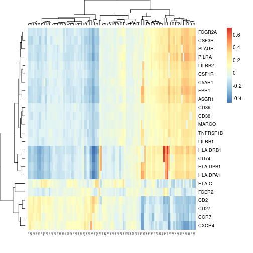

In addition to displaying the scores for the correlations, this function can also be used to identify correlations above a certain value (using the `bool` and `bool_thresh` arguments) or to identify the combinations of receptors and transcription factors (TFs) that are connected (with argument `mark_connections`).


```r
cor_heatmap(dom, bool = TRUE, bool_thresh = 0.25)
cor_heatmap(dom, bool = FALSE, mark_connections = TRUE)
```

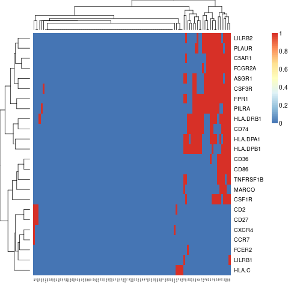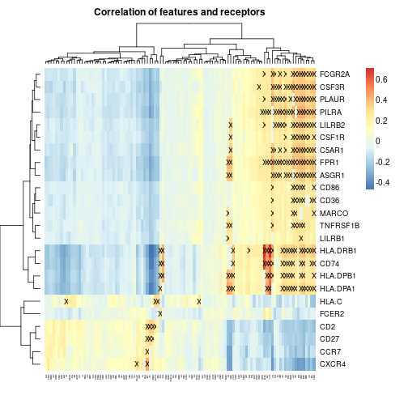

If only a subset of receptors or transcription factors are of interest, a vector of either (or both) can be passed to the function.

```r
recs <- c("CSF1R", "CSF3R", "CCR7", "FCER2")
tfs <- c("PAX5", "JUNB", "FOXJ3", "FOSB")
cor_heatmap(dom, feats = tfs, recs = recs)
```

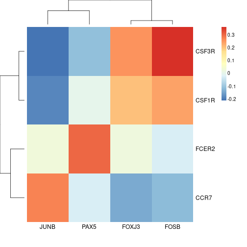

The heatmap functions in domino2 are based on `NMF::aheatmap()` and will also accept additional arguments meant for that function. For example, while an argument for clustering rows or columns of the heatmap is not explicitly stated, they can still be passed to `NMF::aheatmap()` through `cor_heatmap()`.

```r
cor_heatmap(dom,
  title = FALSE, Rowv = NA, Colv = NA,
  main = "Heatmap Without Clustering"
)
```

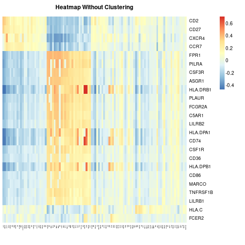

### Heatmap of Transcription Factor Activation Scores

`feat_heatmap()` is used to show the transcription factor activation for features in the signaling network. 

```r
feat_heatmap(dom)
```

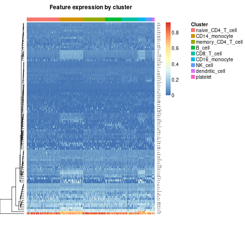

It functions similarly to `cor_heatmap()`, with arguments to select a specific vector of features, to use a boolean view with a threshold, and to pass other arguments to `NMF::aheatmap()`. Specific to this function though are arguments for setting the range of values to be visualized and one to choose whether or not to normalize the scores to the max value.

```r
feat_heatmap(dom,
  min_thresh = 0.1, max_thresh = 0.6,
  norm = TRUE, bool = FALSE
)
feat_heatmap(dom, bool = TRUE)
```

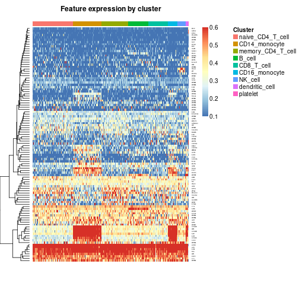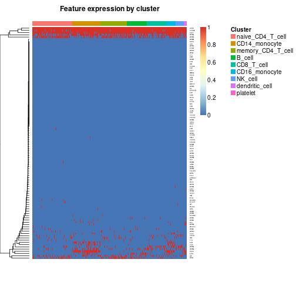

### Heatmap of Incoming Signaling for a Cluster
`incoming_signaling_heatmap()` can be used to visualize the cluster average expression of the ligands capable of activating the TFs enriched in the cluster. For example, to view the incoming signaling of the CD8  T cells:

```r
incoming_signaling_heatmap(dom, "CD8_T_cell")
```

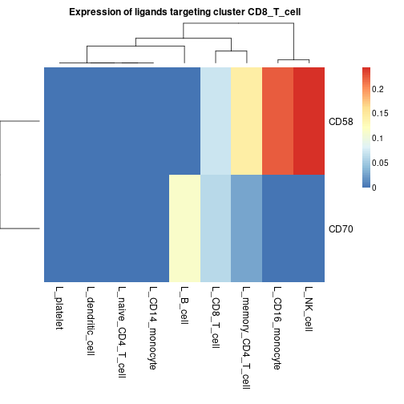
We can also select for specific clusters of interest that are signaling to the CD8 T cells. If we are only interested in viewing the monocyte signaling:

```r
incoming_signaling_heatmap(dom, "CD8_T_cell", clusts = c("CD14_monocyte", "CD16_monocyte"))
```

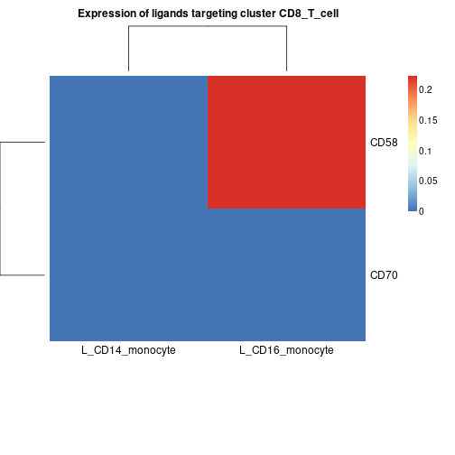

As with our other heatmap functions, options are available for a minimum threshold, maximum threshold, whether to scale the values after thresholding, whether to normalize the matrix, and the ability to pass further arguments to `NMF::aheatmap()`.

### Heatmap of Signaling Between Clusters
`signaling_heatmap()` makes a heatmap showing the signaling strength of ligands from each cluster to receptors of each cluster based on averaged expression.


```r
signaling_heatmap(dom)
```

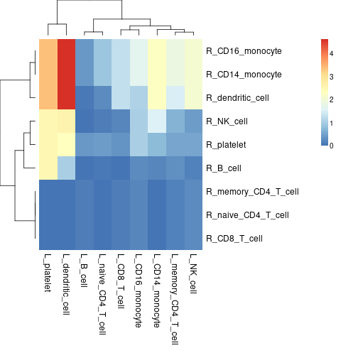

As with other functions, specific clusters can be selected, thresholds can be set, and normalization methods can be selected as well.


```r
signaling_heatmap(dom, scale = "sqrt")
signaling_heatmap(dom, normalize = "rec_norm")
```

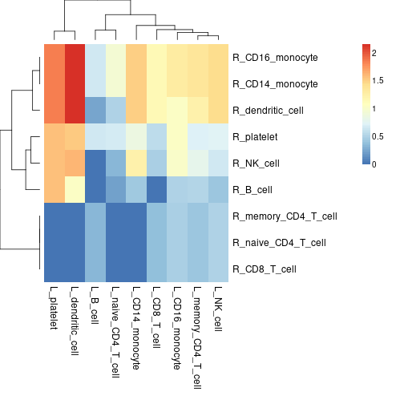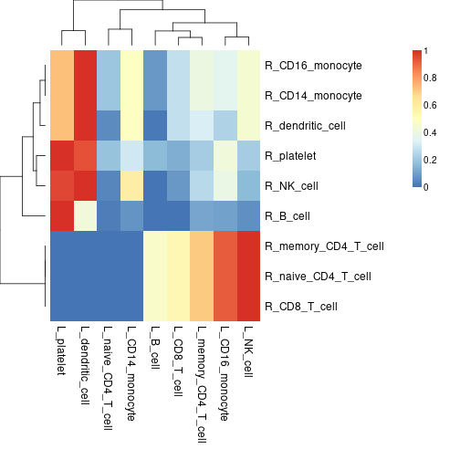

## Network Plots

### Network showing L-R-TF signaling between clusters
`gene_network()` makes a network plot to display signaling in selected clusters such that ligands, receptors and features associated with those clusters are displayed as nodes with edges as linkages. To look at signaling to the CD16 Monocytes from the CD14 Monocytes:

```r
gene_network(dom, clust = "CD16_monocyte", OutgoingSignalingClust = "CD14_monocyte")
```

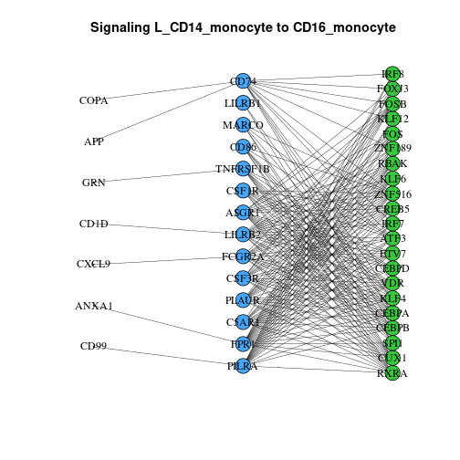

Options to modify this plot include adjusting scaling for the ligands and different layouts (some of which are more legible than others).

```r
gene_network(dom,
  clust = "CD16_monocyte", OutgoingSignalingClust = "CD14_monocyte",
  lig_scale = 25, layout = "sphere"
)
```

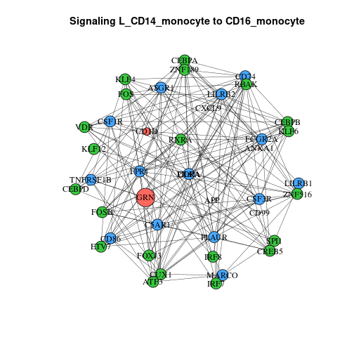

Additionally, colors can be given for select genes (for example, to highlight a specific signaling path).

```r
gene_network(dom,
  clust = "CD16_monocyte", OutgoingSignalingClust = "CD14_monocyte",
  cols = c("CD1D" = "violet", "LILRB2" = "violet", "FOSB" = "violet"), lig_scale = 10
)
```

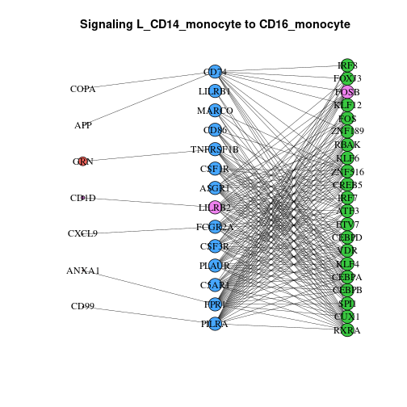

### Network Showing Interaction Strength Across Data
`signaling_network()` can be used to create a network plot such that nodes are clusters and the edges indicate signaling from one cluster to another.

```r
signaling_network(dom)
```

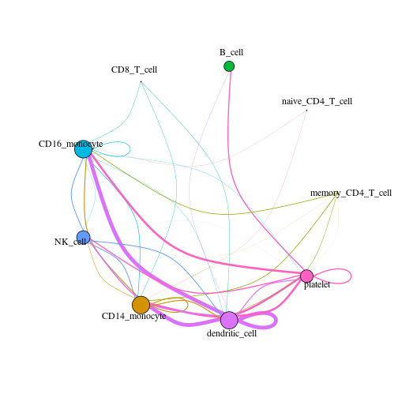

In addition to changes such as scaling, thresholds, or layouts, this plot can be modified by selecting incoming or outgoing clusters (or both!). An example to view signaling from the CD14 Monocytes to other cluster:

```r
signaling_network(dom,
  showOutgoingSignalingClusts = "CD14_monocyte", scale = "none",
  norm = "none", layout = "fr", scale_by = "none", vert_scale = 5
)
```

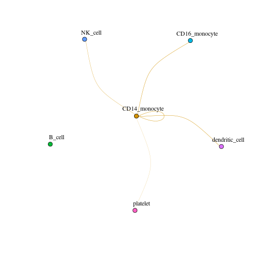

## Other Types of Plot

### Chord Diagrams Connecting Ligands and Receptors
A new addition to domino2, `circos_ligand_receptor()` creates a chord plot showing ligands that can activate a specific receptor, displaying mean cluster expression of the ligand with the width of the chord.

```r
circos_ligand_receptor(dom, receptor = "CD74")
```

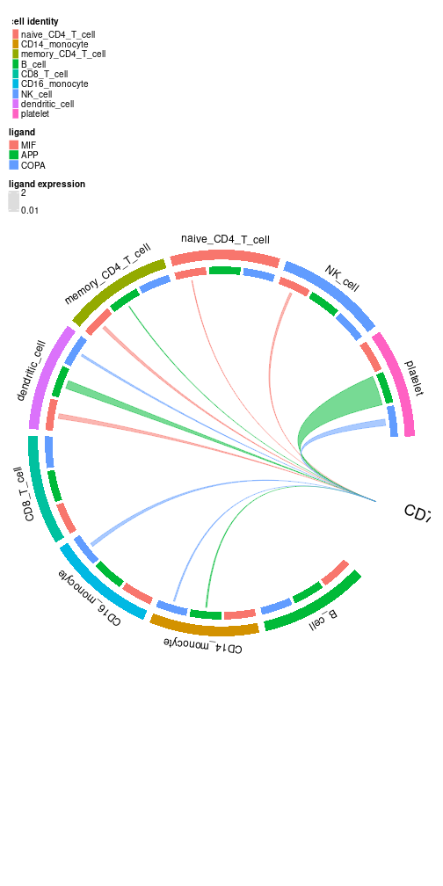

This function can be given cluster colors to match other plots you may make with your data. In addition, the plot can be adjusted by changing the threshold of ligand expression required for a linkage to be visualized or selecting clusters of interest.

```r
cols <- c(
  "red", "orange", "green", "blue", "pink", "purple",
  "slategrey", "firebrick", "hotpink"
)
names(cols) <- levels(dom@clusters)
circos_ligand_receptor(dom, receptor = "CD74", cell_colors = cols)
```

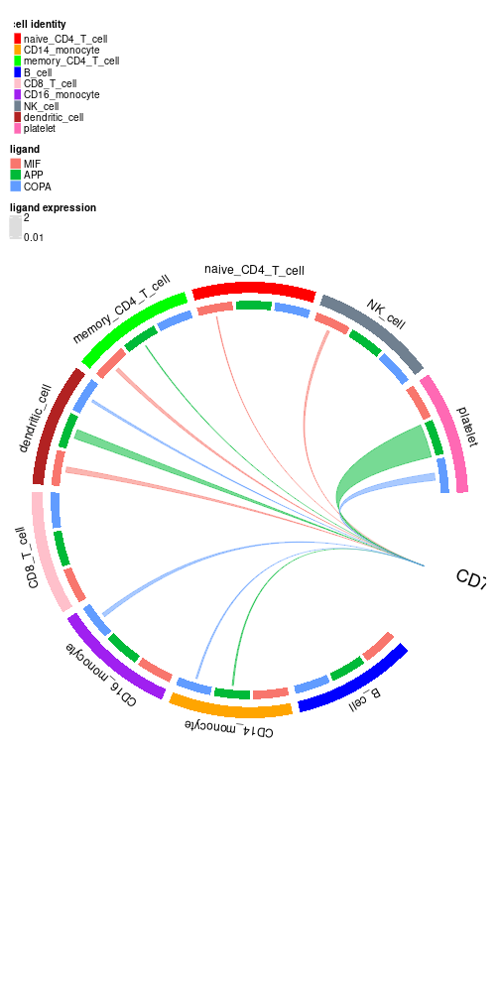

### Scatter Plot to Visualize Correlation
`cor_scatter()` can be used to plot each cell based on expression of the selected TF and receptor. This produces a scatter plot as well as a line of best fit to look at receptor-TF correlation.

```r
cor_scatter(dom, "FOSB", "CD74")
```

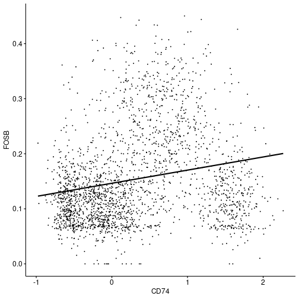
Do keep in mind that there is an argument for `remove_rec_dropout` that should match the parameter that was used when the domino object was built. In this case, we did not use that build parameter, so we will leave the value in this argument as its default value of FALSE.

## Continued Development

Since domino2 is a package still being developed, there are new functions and features that will be implemented in future versions. In the meantime, to view an example analysis, see our [Getting Started](vignette("domino2")) page, or see our [domino object structure](vignette("domino_object_vignette")) page to get familiar with the object structure. Additionally, if you find any bugs, have further questions, or want to share an idea, please let us know [here](https://github.com/FertigLab/domino_development/issues).

<details><summary>Vignette Build Information</summary>
Date last built and session information:

```r
Sys.Date()
#> [1] "2023-09-26"
sessionInfo()
#> R version 4.2.1 (2022-06-23)
#> Platform: x86_64-pc-linux-gnu (64-bit)
#> Running under: Ubuntu 22.04.2 LTS
#> 
#> Matrix products: default
#> BLAS:   /usr/lib/x86_64-linux-gnu/blas/libblas.so.3.10.0
#> LAPACK: /usr/lib/x86_64-linux-gnu/lapack/liblapack.so.3.10.0
#> 
#> locale:
#>  [1] LC_CTYPE=en_US.UTF-8       LC_NUMERIC=C              
#>  [3] LC_TIME=en_US.UTF-8        LC_COLLATE=en_US.UTF-8    
#>  [5] LC_MONETARY=en_US.UTF-8    LC_MESSAGES=en_US.UTF-8   
#>  [7] LC_PAPER=en_US.UTF-8       LC_NAME=C                 
#>  [9] LC_ADDRESS=C               LC_TELEPHONE=C            
#> [11] LC_MEASUREMENT=en_US.UTF-8 LC_IDENTIFICATION=C       
#> 
#> attached base packages:
#> [1] grid      stats     graphics  grDevices utils     datasets  methods  
#> [8] base     
#> 
#> other attached packages:
#>  [1] patchwork_1.1.3       RColorBrewer_1.1-3    Biobase_2.56.0       
#>  [4] BiocGenerics_0.42.0   knitr_1.44            ComplexHeatmap_2.12.1
#>  [7] circlize_0.4.15       plyr_1.8.8            loomR_0.2.1.9000     
#> [10] hdf5r_1.3.8           R6_2.5.1              SeuratObject_4.1.3   
#> [13] Seurat_4.3.0.1        domino2_0.2.1        
#> 
#> loaded via a namespace (and not attached):
#>   [1] utf8_1.2.3             spatstat.explore_3.2-3 reticulate_1.32.0     
#>   [4] R.utils_2.12.2         tidyselect_1.2.0       htmlwidgets_1.6.2     
#>   [7] Rtsne_0.16             munsell_0.5.0          codetools_0.2-19      
#>  [10] ica_1.0-3              future_1.33.0          miniUI_0.1.1.1        
#>  [13] withr_2.5.1            spatstat.random_3.1-6  colorspace_2.1-0      
#>  [16] progressr_0.14.0       rstudioapi_0.15.0      stats4_4.2.1          
#>  [19] ROCR_1.0-11            ggsignif_0.6.4         tensor_1.5            
#>  [22] listenv_0.9.0          NMF_0.26               labeling_0.4.3        
#>  [25] polyclip_1.10-4        bit64_4.0.5            farver_2.1.1          
#>  [28] rprojroot_2.0.3        parallelly_1.36.0      vctrs_0.6.3           
#>  [31] generics_0.1.3         xfun_0.40              doParallel_1.0.17     
#>  [34] clue_0.3-65            spatstat.utils_3.0-3   cachem_1.0.8          
#>  [37] promises_1.2.1         scales_1.2.1           gtable_0.3.4          
#>  [40] globals_0.16.2         processx_3.8.2         goftest_1.2-3         
#>  [43] rlang_1.1.1            GlobalOptions_0.1.2    splines_4.2.1         
#>  [46] rstatix_0.7.2          lazyeval_0.2.2         spatstat.geom_3.2-5   
#>  [49] broom_1.0.5            BiocManager_1.30.22    yaml_2.3.7            
#>  [52] reshape2_1.4.4         abind_1.4-5            backports_1.4.1       
#>  [55] httpuv_1.6.11          tools_4.2.1            usethis_2.2.2         
#>  [58] gridBase_0.4-7         ggplot2_3.4.3          ellipsis_0.3.2        
#>  [61] ggridges_0.5.4         Rcpp_1.0.11            purrr_1.0.2           
#>  [64] prettyunits_1.2.0      ps_1.7.5               ggpubr_0.6.0          
#>  [67] deldir_1.0-9           pbapply_1.7-2          GetoptLong_1.0.5      
#>  [70] cowplot_1.1.1          S4Vectors_0.34.0       zoo_1.8-12            
#>  [73] ggrepel_0.9.3          cluster_2.1.4          fs_1.6.3              
#>  [76] magrittr_2.0.3         data.table_1.14.8      scattermore_1.2       
#>  [79] lmtest_0.9-40          RANN_2.6.1             whisker_0.4.1         
#>  [82] fitdistrplus_1.1-11    R.cache_0.16.0         matrixStats_1.0.0     
#>  [85] mime_0.12              evaluate_0.21          xtable_1.8-4          
#>  [88] IRanges_2.30.1         gridExtra_2.3          shape_1.4.6           
#>  [91] compiler_4.2.1         tibble_3.2.1           KernSmooth_2.23-22    
#>  [94] crayon_1.5.2           R.oo_1.25.0            htmltools_0.5.6       
#>  [97] mgcv_1.9-0             later_1.3.1            tidyr_1.3.0           
#> [100] MASS_7.3-60            Matrix_1.6-1.1         car_3.1-2             
#> [103] cli_3.6.1              R.methodsS3_1.8.2      parallel_4.2.1        
#> [106] igraph_1.5.1           pkgconfig_2.0.3        pkgdown_2.0.7         
#> [109] registry_0.5-1         sp_2.0-0               plotly_4.10.2         
#> [112] spatstat.sparse_3.0-2  foreach_1.5.2          rngtools_1.5.2        
#> [115] stringr_1.5.0          callr_3.7.3            digest_0.6.33         
#> [118] sctransform_0.4.0      RcppAnnoy_0.0.21       spatstat.data_3.0-1   
#> [121] rmarkdown_2.25         leiden_0.4.3           uwot_0.1.16           
#> [124] shiny_1.7.5            rjson_0.2.21           lifecycle_1.0.3       
#> [127] nlme_3.1-163           jsonlite_1.8.7         carData_3.0-5         
#> [130] desc_1.4.2             viridisLite_0.4.2      fansi_1.0.4           
#> [133] pillar_1.9.0           lattice_0.21-8         pkgbuild_1.4.2        
#> [136] fastmap_1.1.1          httr_1.4.7             survival_3.5-7        
#> [139] remotes_2.4.2.1        glue_1.6.2             png_0.1-8             
#> [142] iterators_1.0.14       bit_4.0.5              stringi_1.7.12        
#> [145] memoise_2.0.1          styler_1.10.2          dplyr_1.1.3           
#> [148] irlba_2.3.5.1          future.apply_1.11.0
```
</details>
